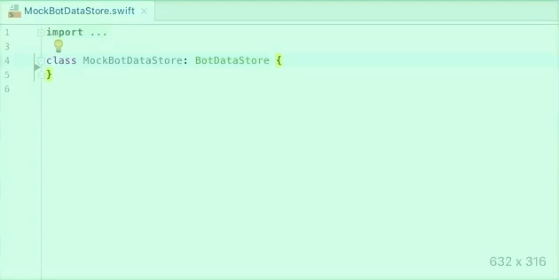

# Swift Mock Generator for AppCode

An AppCode plugin to generate mock classes automatically. 



See my [original blog post](http://seanhenry.codes/ios/generate-swift-mock-appcode-plugin/) for more information.

[Looking for the Xcode version?](https://github.com/seanhenry/SwiftMockGeneratorForXcode)

## Install Swift Mock Generator for AppCode

- Open AppCode
- Open AppCode → Preferences `⌘,`
- Go to Plugins
- Click Browse repositories...
- Search for 'Swift Mock Generator for AppCode'
- Click Install
- Restart AppCode

## How to create a new Swift mock

- Create an empty mock class conforming to one or many protocols.
- With the cursor inside the class declaration, press `⌥↵`.
- Select 'Generate mock'.

## How to recreate a Swift mock

If you change the underlying protocol its mock will need to be regenerated.  

To regenerate the mock, place the cursor anywhere inside the mock and select ‘Generate mock’ again.

## Features

| Feature | Supported |
|---|---|
| Swift 3 and 4.|✅|
| Captures invocation status of methods.|✅|
| Captures invocation status of properties.|✅|
| Captures invoked method parameters.|✅|
| Stubs values for your mocks to return.|✅|
| Stubs a default value for return values where possible.|✅|
| Automatically calls closure parameters with stubbed values.|✅|
| Supports mocks conforming to one or many protocols.|✅|
| Handles overloaded method declarations.|✅|
| Regenerate your mock in one action.|✅|
| Supports associated types.|✅|
| Supports parameter type-annotation attributes and inout.|✅|
| Respects public and open mocks and makes queries publicly available.|✅|
| Records multiple invocations of methods.|✅|
| Records multiple invocations of method parameters.|✅|
| Generate mocks from protocols in 3rd party frameworks.|✅|
| Generate mocks from classes||

## Usage example

A protocol called Animator that we wish to mock:

```
protocol Animator {
    func animate(duration: TimeInterval, animations: () -> (), completion: (Bool) -> ()) -> Bool
}
```
Create a mock class conforming to a protocol:
```
class MockAnimator: Animator {
}
```
Generate the mock:

```
class MockAnimator: Animator {  
  
    var invokedAnimate = false
    var invokedAnimateCount = 0
    var invokedAnimateParameters: (duration: TimeInterval, Void)?
    var invokedAnimateParametersList = [(duration: TimeInterval, Void)]()
    var stubbedAnimateCompletionResult: (Bool, Void)?
    var stubbedAnimateResult: Bool! = false
  
    func animate(duration: TimeInterval, animations: () -> (), completion: (Bool) -> ()) -> Bool {
        invokedAnimate = true
        invokedAnimateCount += 1
        invokedAnimateParameters = (duration, ())
        invokedAnimateParametersList.append((duration, ()))
        animations()
        if let result = stubbedAnimateCompletionResult {
            completion(result.0)
        }
        return stubbedAnimateResult
    }
}
```
Inject the mock into the class you wish to test:

```
let mockAnimator = MockAnimator()
let object = ObjectToTest(animator: mockAnimator)
```
Test if animate method was invoked:

```
func test_mockCanVerifyInvokedMethod() {
    object.myMethod()
    XCTAssertTrue(mockAnimator.invokedAnimate)
}
```
Test the correct parameter was passed to animate:

```
func test_mockCanVerifyInvokedParameters() {
    object.myMethod()
    XCTAssertEqual(mockAnimator.invokedAnimateParameters?.duration, 5)
}
```
Test the number of times animate was invoked:

```
func test_mockCanVerifyInvokedMethodCount() {
    object.myMethod()
    object.myMethod()
    XCTAssertEqual(mockAnimator.invokedAnimateCount, 2)
}
```
Test the parameters passed into each call of the animate method:

```
func test_mockCanVerifyMultipleInvokedMethodParameters() {
    object.myMethod()
    object.myMethod()
    XCTAssertEqual(mockAnimator.invokedAnimateParametersList[0].duration, 5)
    XCTAssertEqual(mockAnimator.invokedAnimateParametersList[1].duration, 5)
}
```
Stub a return value for the animate method:

```
func test_mockCanReturnAStubbedValue() {
    mockAnimator.stubbedAnimateResult = true
    let result = object.myMethod()
    XCTAssertTrue(result)
}
```
Stub the value for the completion closure in the animate method:

```
func test_mockCanCallClosure_withStubbedValue() {
    mockAnimator.stubbedAnimateCompletionResult = (false, ())
    object.myMethod()
    XCTAssertFalse(object.animationDidComplete)
}
```

## Nomenclature

Despite being called a Mock Generator, this plugin actually generates something closer to a spy and stub. The word 'mock', whilst not technically correct, has been used because test doubles such as spies, mocks, and stubs have become colloquially known as mocks.
